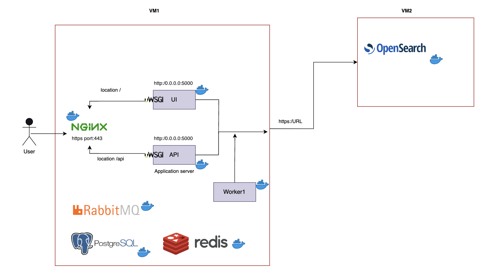

At JLab, we use containerised deployment of all the components for InevnioRDM instance.  
Docker Image are built manually for each release of the JRDB. These image are stored in [dockerHUB](https://hub.docker.com/repository/docker/jeffersonlab/inveniordm_jlab/general)

We plan to use GITLAB CI/CD to auto build and push docker image to dockerHUB once CI/CD becomes available at JLab.

We use two host.

- **HostA:**  
    Here we deploy all the services except for opensearch. The services are: 

    - 3 invenioRDM related containers namely web-ui, web-api and wroker. 
    - Each of redis, rabbitMQ, posgressql, nginx

- **HostB:**  
    Here we deploy a opensearch v2 instance.

