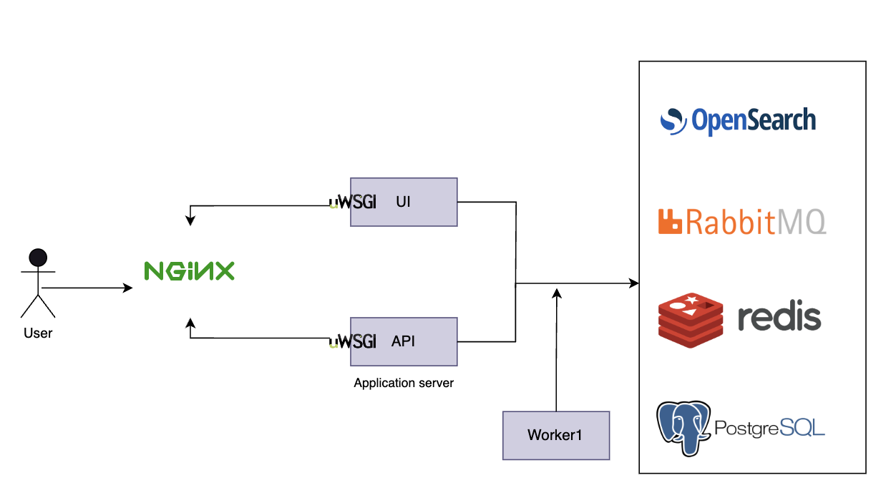

The detail explanation of infrastructure architecture of InvenioRDM is available [here](https://inveniordm.docs.cern.ch/develop/architecture/infrastructure/).  
Jefferson Lab instance architecture choice is shown below:

We use the following:

- **Load balancers:** Nginx 
- **Web servers:** Nginx
- **Application servers:** UWSGI
- **Distributed task queue:** Celery
- **Database:** PostgreSQL
- **Search engine:** OpenSearch v2
- **Message queue:** RabbitMQ
- **Cache system:** Redis
- **Storage system:** Local