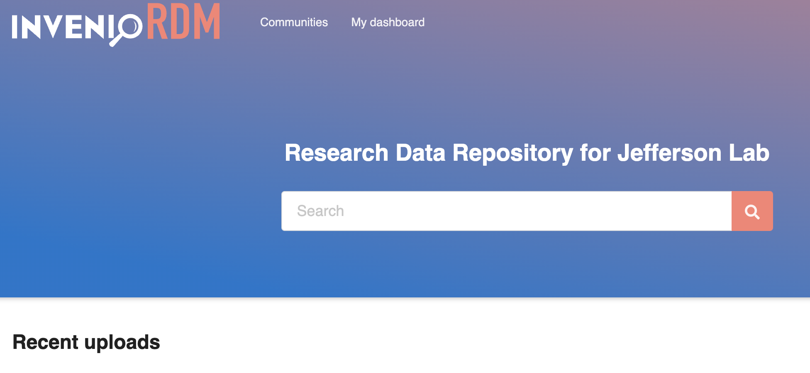
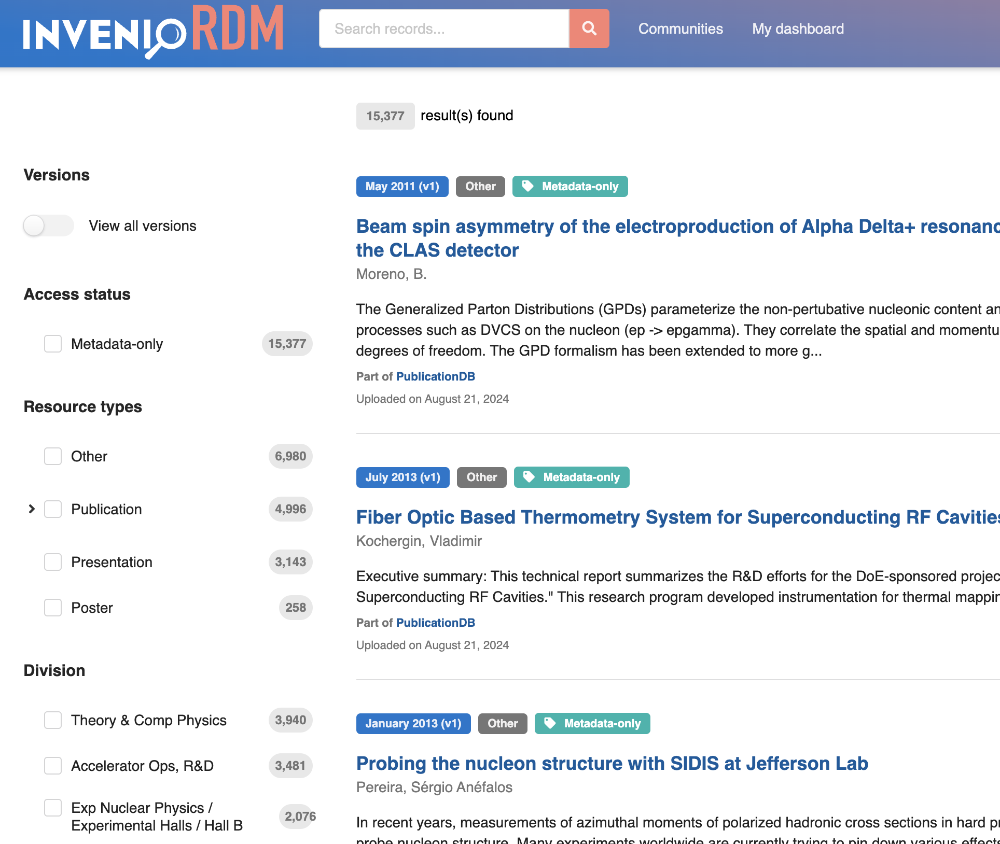

The current instance we have all the record as open access. Thus you don't need to login to get access to the records. 
No signup option is available for now (even though you see signup option in UI, it doesn't work.)
We will soon plan to integrate federated login with CILOGON stay tuned.

Once you got to the URL: [https://jrdb.jlab.org](https://jrdb.jlab.org), you will land on the landing page as shown below:

You can start typing your search commands ( info in [search guide](../search-guide/search-guide.md)) on "search" box.

 
If you want to see the faceted search , click on "search icon" and you will see page shown below.

Here you can see faceted search option on the left. (please scroll down to see all option)

